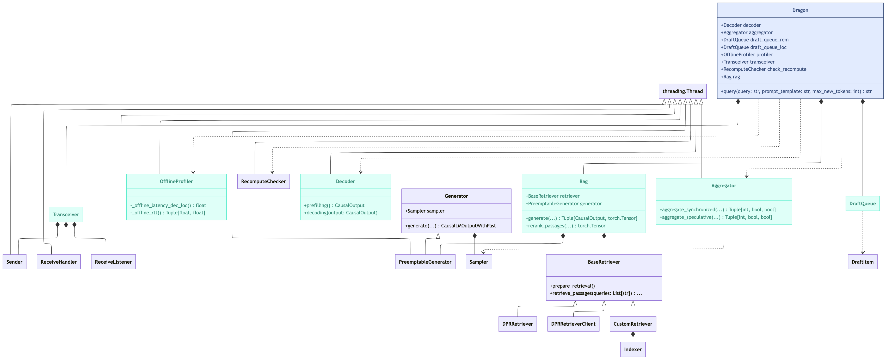

# DRAGON
DRAGON is a device-cloud distributed RAG framework that enables a simultaneous integration of personalized information and generic knowledge.

## Framework Overview
### Class Diagram

### Module List
|Module|Description|File Path|
|--|--|--|
|Dragon|Top class that defines the framework|/dragon/dragon.py|
|Generator|A class that encapsulates the generation of text using a causal language model. It handles model initialization, tokenization, and the generation process.|/dragon/generator.py|
|Indexer|Handles indexing of documents for efficient retrieval.|/dragon/indexer.py|
|Retriever|Retrieves relevant documents based on the query.|/dragon/retriever.py|
|DraftQueue|Manages draft tokens during the generation process.|/dragon/queues.py|
|DraftItem|Represents a single draft token with metadata.|/dragon/queues.py|
|Decoder|Performs the decoding process for text generation.|/dragon/decoder.py|
|OfflineProfiler|Profiles the system performance for offline analysis.|/dragon/profiler.py|
|Transceiver|Handles communication between distributed components.|/dragon/transceiver.py|
|Aggregator|Aggregates results from multiple decoding processes.|/dragon/aggregator.py|
|Rag|Implements the retrieval-augmented generation logic.|/dragon/rag.py|

## Logsumexp Trick for Output Aggregation 
$$\begin{aligned}
log(y)&=\log \sum_{k} \frac{\exp(w^k)}{\sum_i \exp(w^i)}\cdot \frac{\exp(z^k)}{\sum_j \exp(z^k_j)}\\
&=\log \sum_k \exp(\log \frac{\exp(w^k)}{\sum_i \exp(w^i)}+\log \frac{\exp(z^k)}{\sum_j \exp(z^k_j)})\\
&=logsumexp(logsoftmax(w)+logsoftmax(z))
\end{aligned}$$

## Additional Experiments
### Language Modeling
#### Hyperparameters
|Hyperparameter         |Value   |Description                           |
|-----------------------|--------|--------------------------------------|
|retriever.s_passage    |64      |Number of words in a retrieved passage|
|text.with_title        |true    |Insert title before each passage      |
|generator.s_sequence   |896     |Total tokens in a test rolling window |
|evaluator.s_prefix     |128     |Total tokens as query for retrieval   |
|generator.model        |facebook/opt-1.3b  |Generator model            |
|retriever model        |facebook/contriever|Retriever model            |

#### Results
|Dataset     |s_context |n_docs    |s_aggregate|Bits-per-Byte|
|------------|----------|----------|-----------|-------------|
|wikitext-2  |128       |0         |0          |15.3697      |
|            |128       |1         |1          |15.1925      |
|            |128       |2         |2          |15.0293      |
|            |128       |4         |4          |14.9244      |
|            |128       |8         |8          |14.8589      |
|            |128       |16        |16         |14.8100      |
|            |128       |4         |1          |15.1016      |
|            |512       |4         |1          |14.9528      |
|            |1024      |4         |1          |14.9528      |
|            |128       |4         |2          |14.9274      |
|            |512       |4         |2          |14.8782      |
|            |512       |8         |2          |14.6875      |
|wikitext-103|128       |0         |0          |15.3697      |
|            |128       |1         |1          |15.1470      |
|            |128       |2         |2          |14.9394      |
|            |128       |4         |4          |14.7789      |
|            |128       |8         |8          |14.6275      |
|            |128       |16        |16         |14.4949      |
|            |128       |4         |1          |14.9977      |
|            |512       |4         |1          |14.7037      |
|            |1024      |4         |1          |14.7037      |
|            |128       |4         |2          |14.7508      |
|            |512       |4         |2          |14.6817      |
|            |512       |8         |2          |14.3135      |

### Open-Domain QA

We evaluated DRAGON on the development dataset of Natural Questions, with the number of retrieved documents set to 4.

#### Results

|F1   |EM  |
|-----|----|
|29.99|8.96|

Given the same number of retrieved documents and an infinite context length, the distributed and centralized RAG produce identical results, confirming the correctness of our implementation. We adopt Hugging Face’s evaluation script from [here](https://github.com/huggingface/transformers/blob/v4.30-release/examples/research_projects/rag/eval_rag.py). As this experiment uses a non-instruction-tuned model, the overall performance remains limited. We are currently conducting further experiments with `microsoft/Phi-4-mini-instruct`, `deepseek-ai/DeepSeek-R1-Distill-Qwen-1.5B`, and `Qwen/Qwen2.5-1.5B-Instruct`. Preliminary results support the conclusions presented in our paper.

### Outputs of DRDG/SW vs. DRDG/TW
#### Hyperparameters
|Hyperparameter          |Value   |Description                           |
|------------------------|--------|--------------------------------------|
|retriever.s_passage     |64      |Number of words in a retrieved passage|
|text.with_title         |true    |Insert title before each passage      |
|retriever.passages      |Salesforce/wikitext,wikitext-2-raw-v1|Dataset as passage corpus|
|retriever.s_context     |128|Maximum number of tokens allowed for passage contexts|
|retriever.n_docs        |4|Number of retrieved passages|
|retriever.s_aggregate   |4|Number of parallel decoding processes|
|generator.model         |facebook/opt-1.3b|LLM|
|evaluator.max_new_tokens|100|Number of tokens in the output sequence|

#### Results
|query |output_seq |output_tok|
|------|-----------|----------|
| Carbon dioxide is | a greenhouse gas is gas the Earth, viewed as a thatant global gas. is is viewed as a pollutant of to it is also viewed as a pollutant . Thus it is also viewed as a pollutant is Thus it is also . as a pollutant . is it is also viewed as a pollutant . that it is also viewed as a pollutant. gas it is also viewed as a pollutant . a it is also viewed a pollutant . is it is also viewed as | a greenhouse gas that is produced by the burning of fossil fuels. It is a major component of the atmosphere and is responsible for the greenhouse effect. It is also a greenhouse gas that is produced by the burning of fossil fuels. It is a major component of the atmosphere and is responsible for the greenhouse effect. It is also a greenhouse gas that is produced by the burning of fossil fuels. It is a major component of the atmosphere and is responsible for the greenhouse effect. It is also a greenhouse gas that|
| Ernest Miller Hemingway was | a in writerveston's 18 also a cited as. to of the investon acht Club, of he of also a themervestoningway Club who was a great writer theing he wason aacht man. He was a man who the a greaton, the he was also a great man of the was aon who was a great line of the novel was the a greaton Y line was a novel is was a first line of the novel is also a | a writer and poet who was born in Galveston, Texas in 1882. He was the son of a Methodist minister and a schoolteacher. He was educated at the University of Texas and the University of Texas at Austin. He was a member of the Sigma Phi Epsilon fraternity. He was a member of the Texas Writers Club and the Texas Writers Club. He was a member of the Texas Writers Club. He was a member of the Texas Writers Club. He was a member of the |

Clearly, the outputs of the sequence-wise baseline are disordered, as it relies on post-hoc aggregation that disregards the sequential dependencies between tokens.

### Correctness of Latency Profiling

We measure both the instantaneous online and offline decoding latencies. As shown in the figure above (from the device's perspective), the cloud-side latency remains relatively stable; hence, we directly use the instantaneous values. While the Least Squares Error (LSE) fitting algorithm is sensitive to outliers, **DRAGON provides a more robust estimation**. The y-axis intercept reflects the static system overhead, whereas the difference in slope represents the runtime decoding overhead—likely caused by CPU contention between decoding and other concurrent tasks (e.g., aggregation).